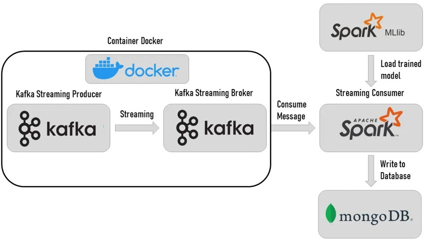
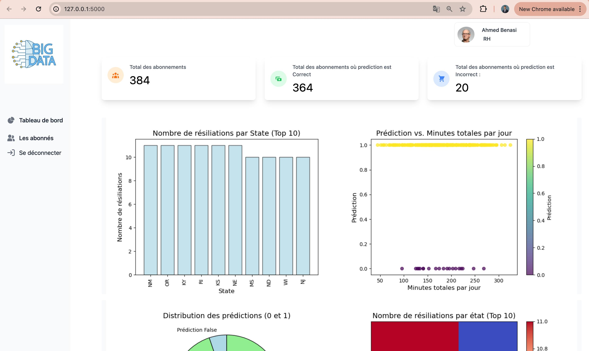
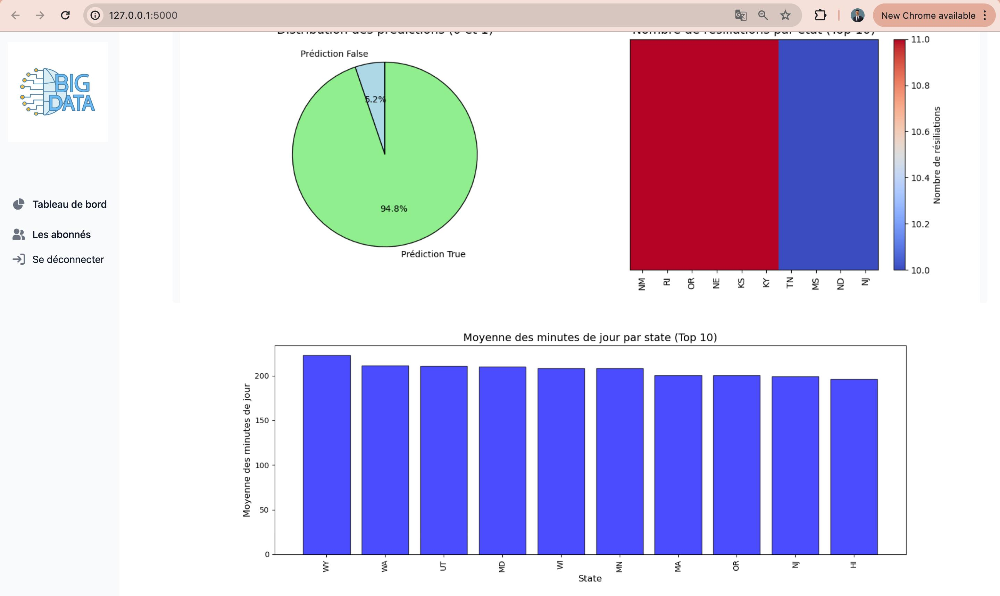

# Prédiction du désabonnement des clients Telecom en temps réel

## Objectif de projet:
Ce projet a pour objectif principal le développement d'une application web basée sur l'API Apache Kafka Stream pour analyser les données et prédire en temps réel le désabonnement des clients d'un opérateur Telecom. L'application s'appuie sur les puissantes capacités de l'ingestion des données de Kafka Stream pour ingérer les données pertinentes, Apache Spark pour le traitement des données, MongoDB pour le stockage, Docker pour la containerisation, et Flask pour l'interface web.

## Architecture du système:
Le diagramme suivant illustre l'architecture du projet :


## Guide d'installation:

### Prérequis:
* **Docker:** [https://www.docker.com/](https://www.docker.com/)
* **Python 3.9:** [https://www.python.org/](https://www.python.org/)
* **Git:** [https://git-scm.com/](https://git-scm.com/)

### Installation:

1. **Cloner le dépôt Git:**
```bash
git clone https://github.com/Ayoubto/churn-prediction.git
cd projet_bigdata
```

2. **Installer les dépendances Python:**
```bash
pip install -r requirements.txt
```

3. **Configurer Kafka et Zookeeper:**
* **Configuration de Kafka et Zookeeper en utilisant Docker Compose:** Démarrez Kafka et Zookeeper en arrière-plan puis vérifiez l'état des services.
```bash
docker-compose -f Docker-Compose.yml up -d
docker-compose -f Docker-Compose.yml ps  # Vérification
```
* **Création du sujet Kafka:** Une fois Kafka et Zookeeper opérationnels, accédez au conteneur kafka2 et créez le sujet churn_topic pour recevoir les flux de données clients.
```bash
docker exec -it kafka2 /bin/bash
kafka-topics --create --topic churn_topic --bootstrap-server localhost:9092
kafka-topics --describe --topic churn_topic --bootstrap-server localhost:9092  # Vérification
```

4. **Préparer Kafka Container:**
```bash
docker cp Producer.py kafka2:/opt/Producer.py
docker cp churn-bigml-20.csv kafka2:/opt/churn-bigml-20.csv
```

5. **Préparer Spark Container:**
```bash
docker cp gbt_model spark2:/opt/bitnami/gbt_model
docker cp Consumer.py spark2:/opt/bitnami/spark/Consumer.py
```

6. **Construire l'image Docker du Producer:**
```bash
docker build -t churn-producer ./Producer
```

7. **Exécuter le Producer Container:**
<br>Assurez-vous que le conteneur kafka2 est en marche avant d'exécutez le Producer Container en montant les volumes du kafka2 pour accéder aux fichiers.
```bash
docker run -it --rm --name churn-producer-container --volumes-from kafka2 churn-producer
```

8. **Démarrer le Kafka Producer:**
<br>Ouvrez un nouveau terminal et naviguez vers le répertoire Producer, puis lancez Producer.py pour envoyer des données à Kafka.
```bash
python Producer.py
```

9. **Démarrer le Spark Consumer:**
<br>Ouvrez un nouveau terminal et naviguer vers le répertoire Consumer, puis lancez Consumer.py pour traiter les données en temps réel avec Spark.
```bash
python Consumer.py
```

10. **Exécuter l'application web:**
```bash
run app.py
```

## Fonctionnalités et utilisation:
L'application web de ce projet offre une interface intuitive et conviviale pour visualiser les résultats de l'analyse de données et les prédictions de désabonnement en temps réel. Elle permet aux utilisateurs d'accéder à des informations précieuses pour comprendre le comportement des clients, identifier les risques de désabonnement et prendre des mesures proactives pour fidéliser la clientèle.



## Contributeurs:

### Réalisé par:
* Abderrazzak EL BOURKADI
* Adnan EL HAYANI
* Ayoub ET-TOUBI
* Firdaous BOULBEN

### Encadré par:
Pr. Yasyn EL YUSUFI
